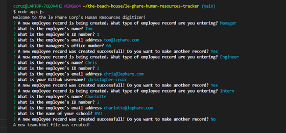
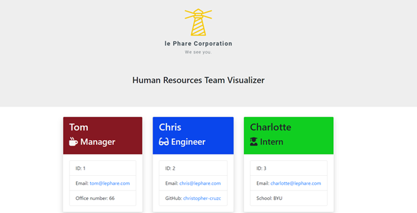

# le-phare-human-resources-tracker
A human resources tracker for team leaders to organize their personnel information.

## Installation

This web app is made up oen central app.js file and five supplmental js files, Inquirer and Jest modules, four template html files, and images for screenshots and the company logo.

The location of the Github repo is: https://github.com/christopher-cruzcosa/le-phare-human-resources-tracker - this is not currently deployed live.

## Usage 

Click here for a video walkthrough: https://youtu.be/oc1sOLnE83o

-----

Below is screenshot of the CLI to generate the tracker.

-----

Below is screenshot of a finished html output as rendered in a browser.

## Credits

Created by: Christopher Cruzcosa

## License

Copyright (c) [2020] [Christopher Cruzcosa]

Permission is hereby granted, free of charge, to any person obtaining a copy
of this software and associated documentation files (the "Software"), to deal
in the Software without restriction, including without limitation the rights
to use, copy, modify, merge, publish, distribute, sublicense, and/or sell
copies of the Software, and to permit persons to whom the Software is
furnished to do so, subject to the following conditions:

The above copyright notice and this permission notice shall be included in all
copies or substantial portions of the Software.

THE SOFTWARE IS PROVIDED "AS IS", WITHOUT WARRANTY OF ANY KIND, EXPRESS OR
IMPLIED, INCLUDING BUT NOT LIMITED TO THE WARRANTIES OF MERCHANTABILITY,
FITNESS FOR A PARTICULAR PURPOSE AND NONINFRINGEMENT. IN NO EVENT SHALL THE
AUTHORS OR COPYRIGHT HOLDERS BE LIABLE FOR ANY CLAIM, DAMAGES OR OTHER
LIABILITY, WHETHER IN AN ACTION OF CONTRACT, TORT OR OTHERWISE, ARISING FROM,
OUT OF OR IN CONNECTION WITH THE SOFTWARE OR THE USE OR OTHER DEALINGS IN THE
SOFTWARE.